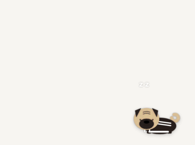
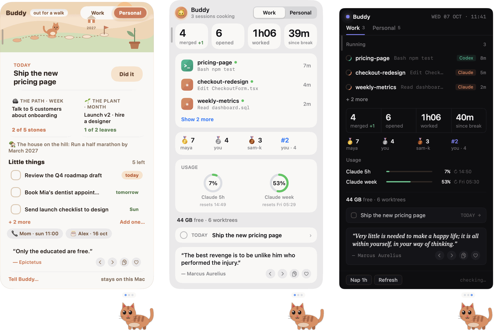
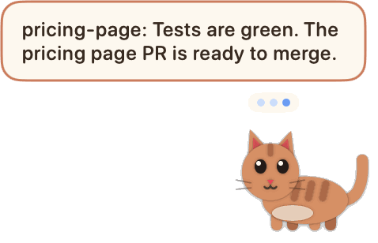
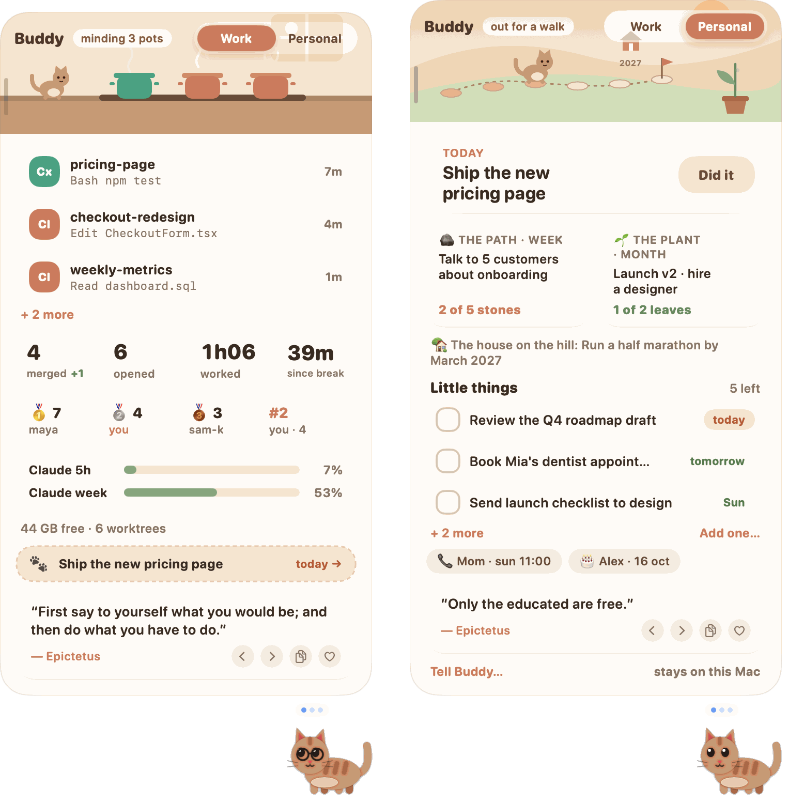
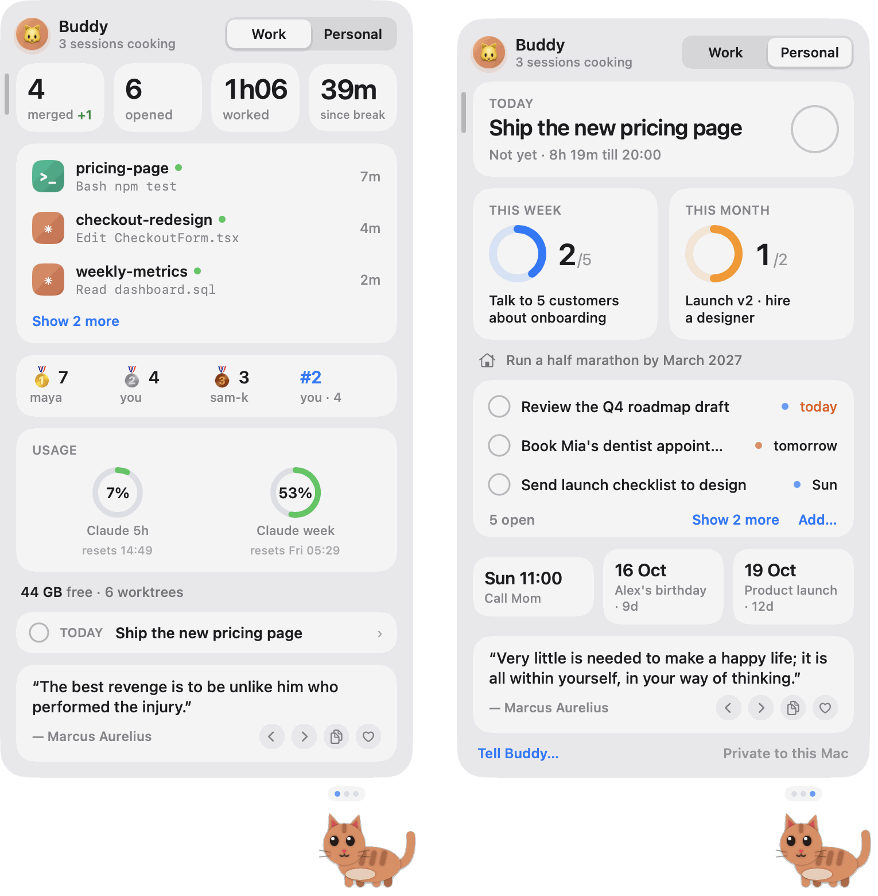
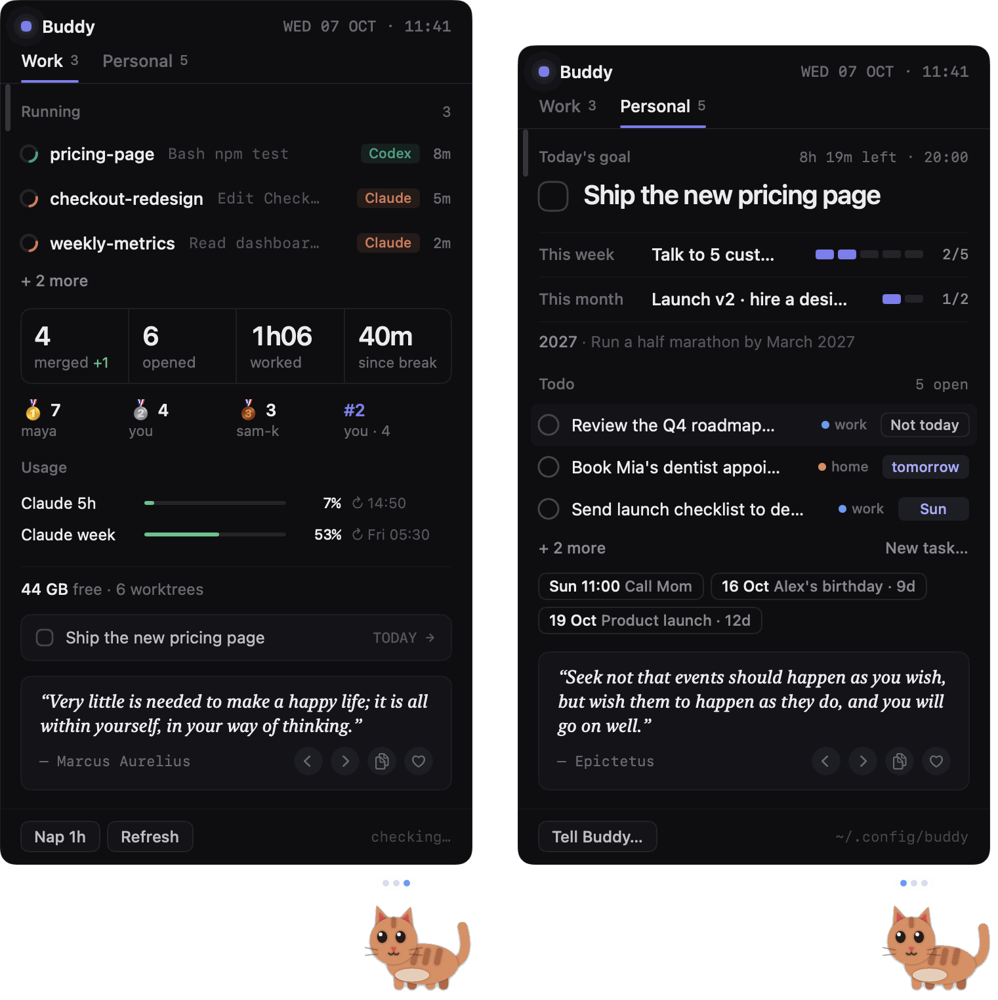
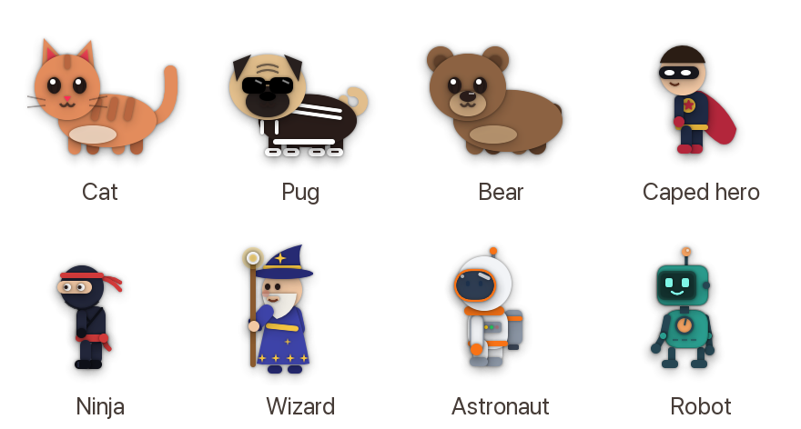
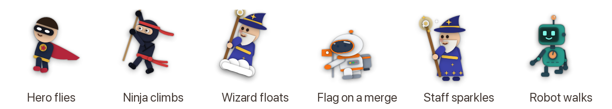
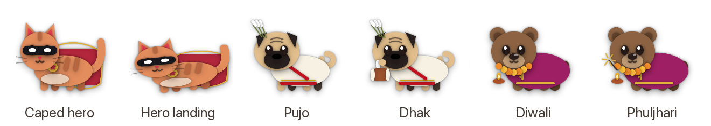

# Buddy

**A little pet that lives on your Mac and tells you when Claude Code or Codex needs you.**

You start an AI agent on a task, switch to email, and forget about it. Buddy sits at the bottom of your screen, watches your agents, and taps you on the shoulder when one is done or waiting for your OK. One click takes you straight back to it.

<p align="center"></p>

<p align="center"></p>

```bash
git clone https://github.com/varun-ml/buddy.git ~/buddy && ~/buddy/install.sh
```

That's the whole install. Buddy builds on your Mac in about a minute and starts right away. **Everything stays on your Mac: no account, no tracking, nothing sent to us.**

---

## What Buddy does for you



- **Tells you when an agent is done**, with its own one-line summary: *"Rewrote email 2: shorter, one clear call to action."* Click the bubble and you're back in that chat or terminal.
- **Tells you when an agent is waiting for your OK**, with a soft sound, so it doesn't sit idle for an hour.
- **Lets agents talk to you.** Any agent can put a message on your screen (*"Tests are green, ready to merge"*). See [Let your agents message you](#let-your-agents-message-you).
- **Shows everything at a glance.** Hover over Buddy to see what's running, what's finished, and how much of your plan you've used.
- **Looks after your day**: nudges you to take a break after 90 minutes, warns you when you're juggling too many agents at once, and tells you when it's time to stop.

<br clear="right">

## Two tabs: Work and Personal

**Work** is what your agents are doing: what's running, what's done, your usage limits, and (if you connect GitHub) your pull requests.

**Personal** is the rest of your life, kept private on your Mac:

- **Goals for today, this week and this month.** Click to tick them off or count them up (*"Talk to 5 customers: 2 of 5"*).
- **One simple to-do list.** Add due dates; Buddy sorts it. Hover any item for "not today".
- **The people who matter.** Birthdays, a nudge to call your mum on Sundays, your kid's bedtime. Right-click Buddy → *Set up my profile…* and answer a few questions.

The card always opens on Work; Personal is one click away.

## Three looks

Right-click Buddy → **Theme**.

| Burrow | Glass | Ink |
|---|---|---|
| Warm and playful. Your pet walks a little path as you make progress on the week's goal, and a plant grows a leaf for each step of the month. | A frosted macOS widget with big numbers and progress rings. | Dark and precise, for people who live in the terminal. |
|  |  |  |

## Pick your buddy

Right-click Buddy → **Buddy**. Three animals, five that aren't, each with five looks. Or `random` for a different one every day.

<p align="center"></p>

Each has its own way of reacting: the hero flies off when a PR breaks, the ninja climbs a rope and throws a toy star, the wizard teleports and floats on a cloud, the astronaut plants a flag when you merge, the robot dances.

<p align="center"></p>

## Costumes and festivals

Right-click Buddy → **Costume** dresses the cat, pug or bear (the other buddies come dressed):

<p align="center"></p>

- **Caped hero:** a cape and mask. It glides instead of walking, does a hero landing when you merge, flies off the screen when a PR breaks, and now and then grapples up to the top of your screen.
- **Pujo** and **Diwali** switch on by themselves from a week before the festival days to three days after. Pujo: a red-bordered drape and kash flowers; it plays the dhak when an agent finishes and does a dhunuchi dance when you merge. Diwali: a kurta and marigold garland; it lights diyas, waves a phuljhari, and carries a diya after dark.
- Pick a costume yourself, or *No costume, ever*, and it won't dress up on its own.

## Everyday use

| You want to… | Do this |
|---|---|
| See what's going on | Hover over Buddy |
| Jump to an agent | Click its row or its bubble |
| Pick a buddy or a costume | Right-click Buddy → *Buddy* or *Costume* |
| Change theme, set goals, add a task, nap for an hour | Right-click Buddy |
| Make the card wider | Drag its outer edge |
| Close Buddy | Right-click → *Close Buddy*. Type `buddy` in Terminal to bring it back |

## What it asks permission for

macOS may ask you three things. All are optional; Buddy works without them.

1. **"Buddy wants to control Terminal"**: only when you click a session that runs in Terminal or iTerm, so Buddy can bring that tab to the front.
2. **Codex → Settings → Hooks → "Trust all"**: if you use Codex, this lets Codex tell Buddy what it's doing.
3. **Your Claude plan limits** are **off by default.** Turn them on with `"claudeLimits": true` in `~/.config/buddy.json`. Buddy then reads the Keychain item "Claude Code-credentials" and calls `api.anthropic.com/api/oauth/usage`, the same thing Claude Code's own `/usage` does. macOS will ask you once.

## Privacy

- **100% local, no telemetry.** Buddy has no server and collects nothing.
- Your goals, to-dos and people live in `~/.config/buddy/` on your Mac. They never leave it.
- The only network calls are ones you turn on: GitHub (through your own `gh` login) for PRs, and Anthropic's usage endpoint for plan limits.

## Let your agents message you

Any agent can run:

```bash
buddy say "Tests are green, PR is ready to merge"
buddy say "I need your decision on the pricing copy" --urgent
```

To make your agents actually do it, paste this into `~/.claude/CLAUDE.md` (Claude Code) and `~/.codex/AGENTS.md` (Codex):

```markdown
## Buddy
When you finish something I'm waiting on, need my decision, or are blocked on me,
run `buddy say "<one short sentence>"` (add --urgent if I must act now).
Under 20 words. No secrets. Not for routine progress.
```

## Settings

All optional, in `~/.config/buddy.json`. Restart Buddy after editing (type `buddy`).

```json
{
  "pet": "random",
  "stop": "19:00",
  "breakMins": 60,
  "juggle": 4,
  "claudeLimits": true,
  "statsRepos": ["your-org/your-repo"]
}
```

| Setting | What it does |
|---|---|
| `pet` | `cat`, `pug`, `bear`, `hero`, `ninja`, `wizard`, `astronaut`, `robot`, or `random` (a different one each day). The right-click menu overrides it. |
| `costume` | `hero`, `durga`, `diwali`, `off` (never), or leave it out to dress up for festivals on its own. Cat, pug and bear only. |
| `outfit` | `none` takes off the pug's tracksuit and shades |
| `stop` | When your workday ends (default 20:00). Buddy yawns and offers a note for tomorrow. |
| `breakMins` | Minutes without a break before the nudge (default 90). Quiet while your mic is on. |
| `juggle` | How many agents at once before Buddy suggests finishing one (default 5) |
| `claudeLimits` | Show your Claude plan usage (default off; see *What it asks permission for*) |
| `statsRepos` | GitHub repos for your merged/opened PR counts and a team leaderboard (needs `gh`) |

## Requirements

- macOS 13 (Ventura) or later
- Apple's command line tools: if the install asks, run `xcode-select --install`
- Claude Code and/or Codex (the desktop app or the CLI)
- Optional: GitHub's `gh`, for PRs

## Remove it

```bash
~/buddy/install.sh --uninstall           # keeps your goals, to-dos and settings
~/buddy/install.sh --uninstall --purge   # deletes those too
```

## Credits

Built by Varun Tulsian with Claude Code. The bear 🐻 is by [Siddharth Sahu](https://github.com/siddharth-meraki).

Want Buddy to work with your agent (Cursor, Gemini CLI, …), or to add a pet, a theme or a fix? See [CONTRIBUTING.md](CONTRIBUTING.md). MIT licensed.
